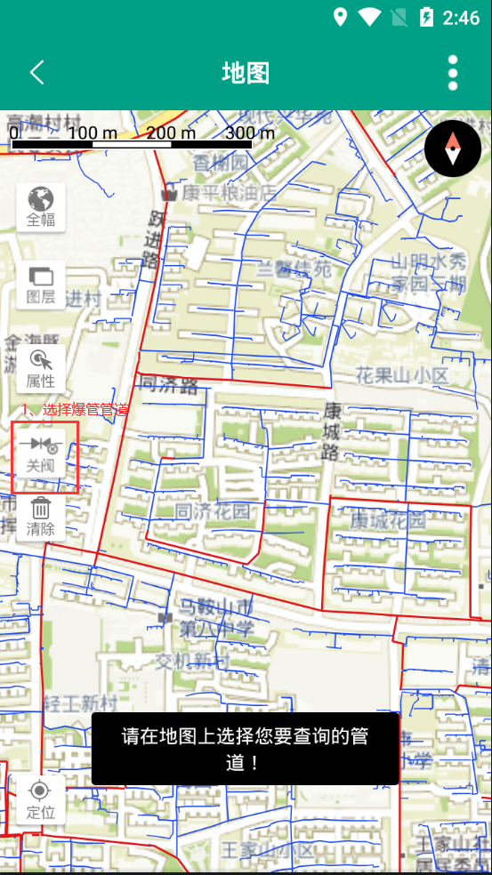
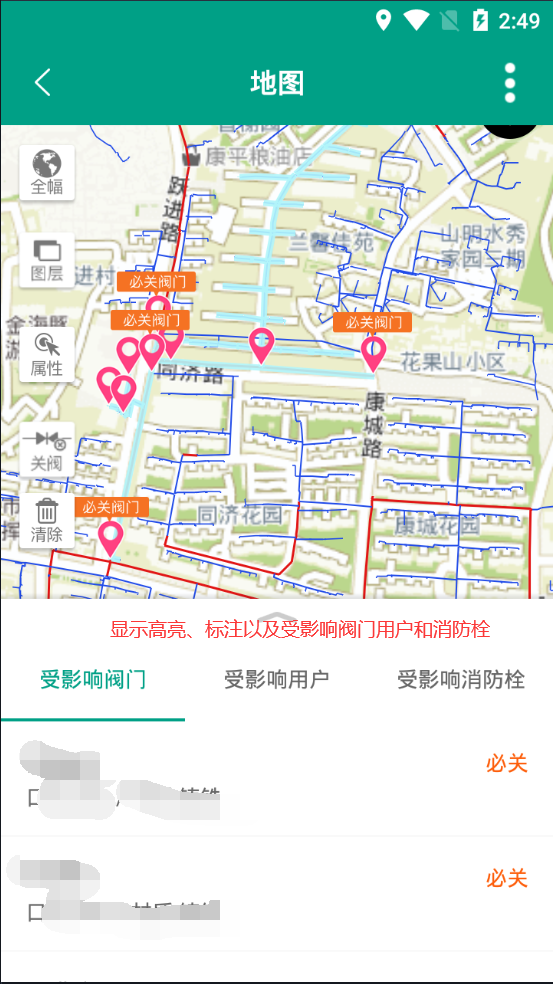
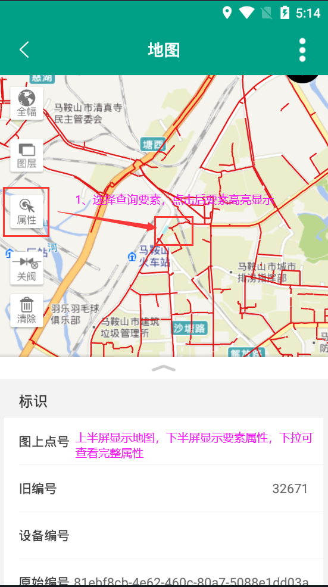
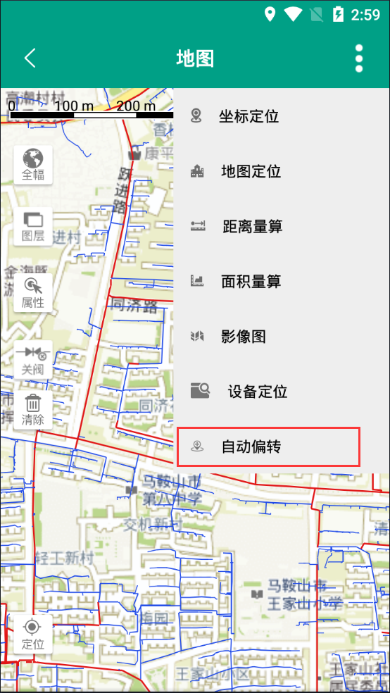
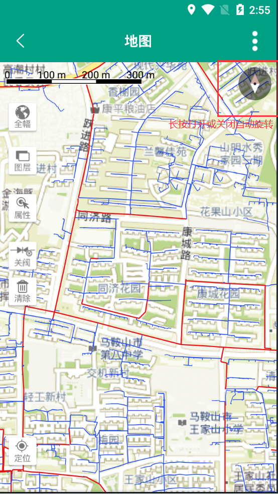
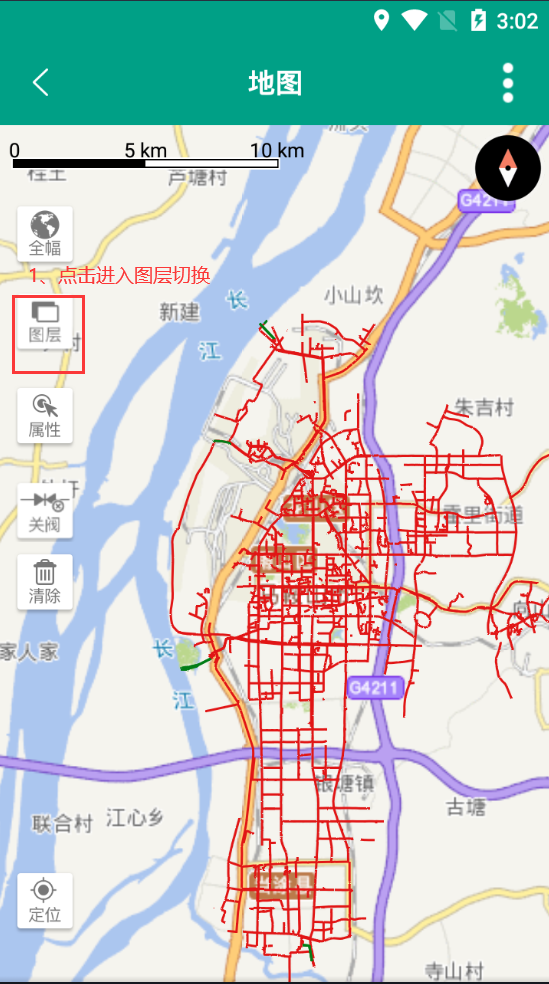
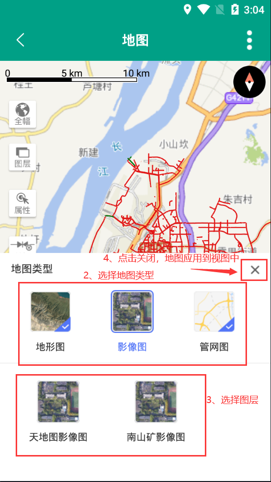

# 3.1移动综合管理平台-移动GIS
##   3.1.1更新
###  3.1.1.1 关阀分析

    受影响阀门和消火栓图标高亮显示；关阀分析后，地图上显示必关阀门标注；下方显示必关、不必关信息。
 

###  3.1.1.2属性查询

    属性查询显示完整的要素属性，属性分组显示。左侧“属性”查询以后的界面分屏显示，上半屏显示图形及被选中的要素，选中的要素高亮显示，下半屏显示属性。

##   3.1.2新增
###  3.1.2.1 坐标定位

    新增平面坐标定位功能。

    
    2）长按指南针可打开或关闭自动旋转，开启时颜色为黑色高亮，关闭时颜色为灰色。

###  3.1.2.3 图层切换

    新增图层按钮，用户可自定义切换视图地图图层，每种地图类型仅限显示一个地图，用户选择好地图后点击“关闭”按钮，选择图层即应用到视图中。

