# 1基础数据管理平台
##   1.1更新
###  1.1.1 条件查询

    1）添加附属设施的状态信息，允许附属设施图层按状态查询。
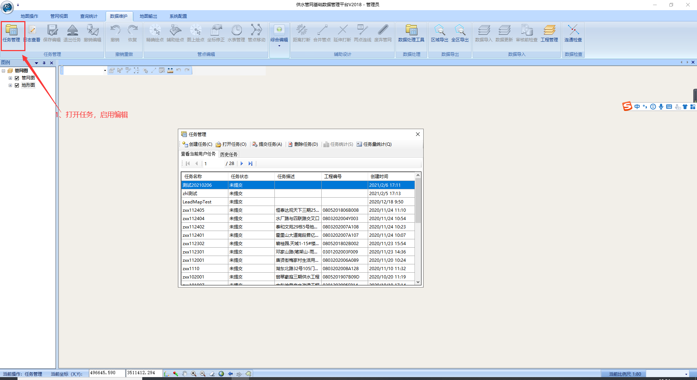
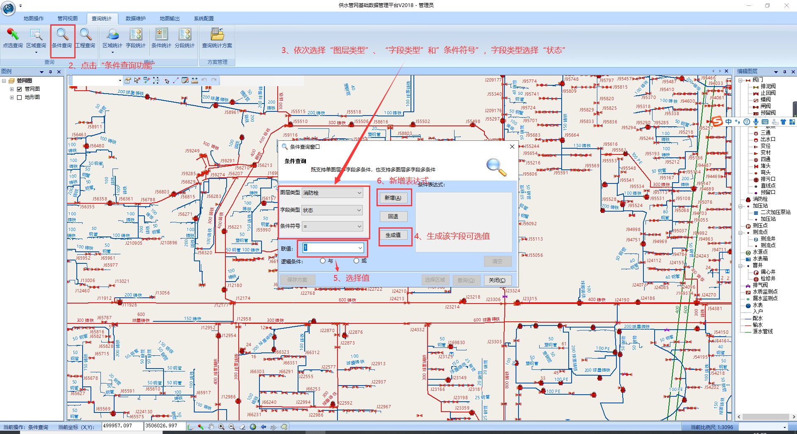
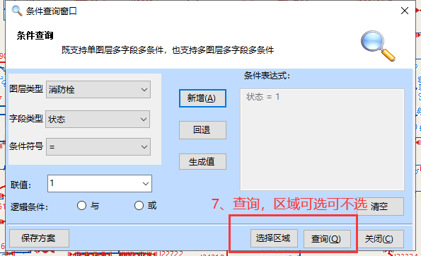

    2）允许无状态设施一键废弃。
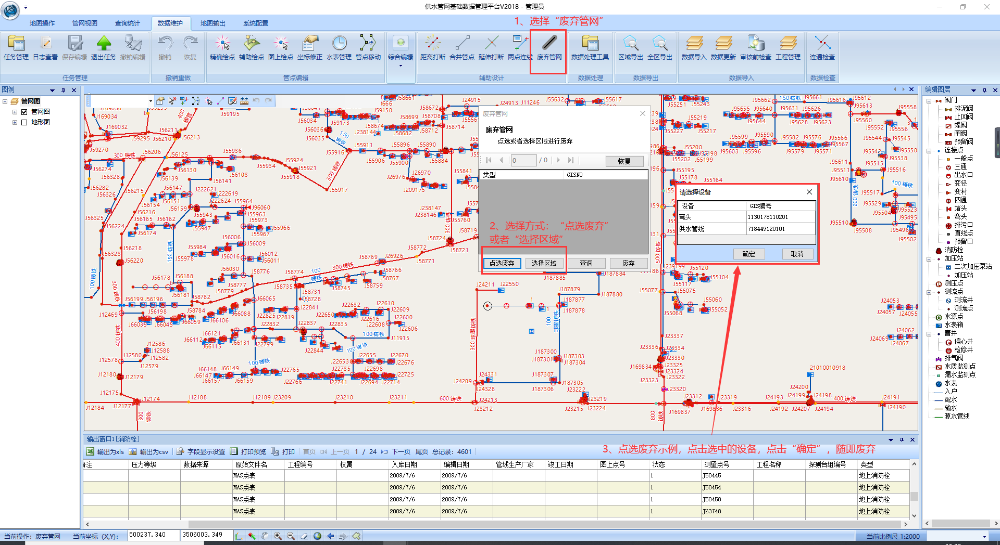

###  1.1.2 任务管理

    任务栏内任务区分显示。
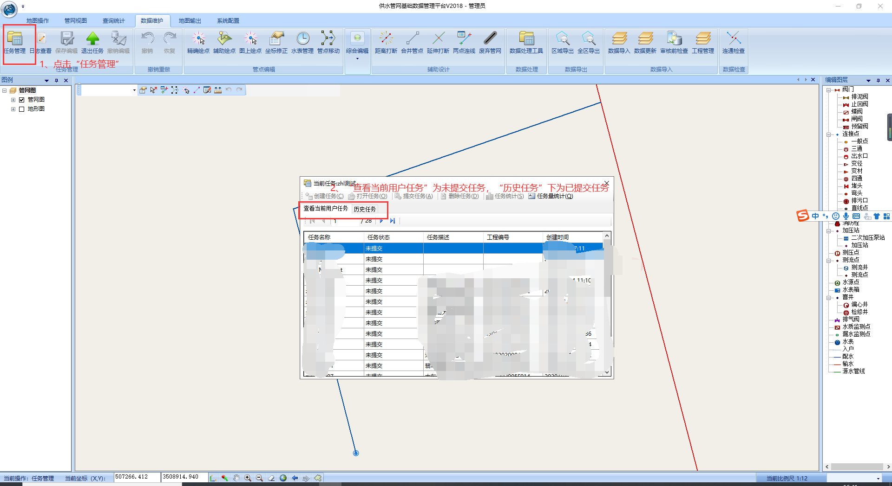

###  1.1.3 数据导入

    修改单表导入约束，允许水表为空时数据导入。当水表数据为空时选择“点线表”导入模式即可。
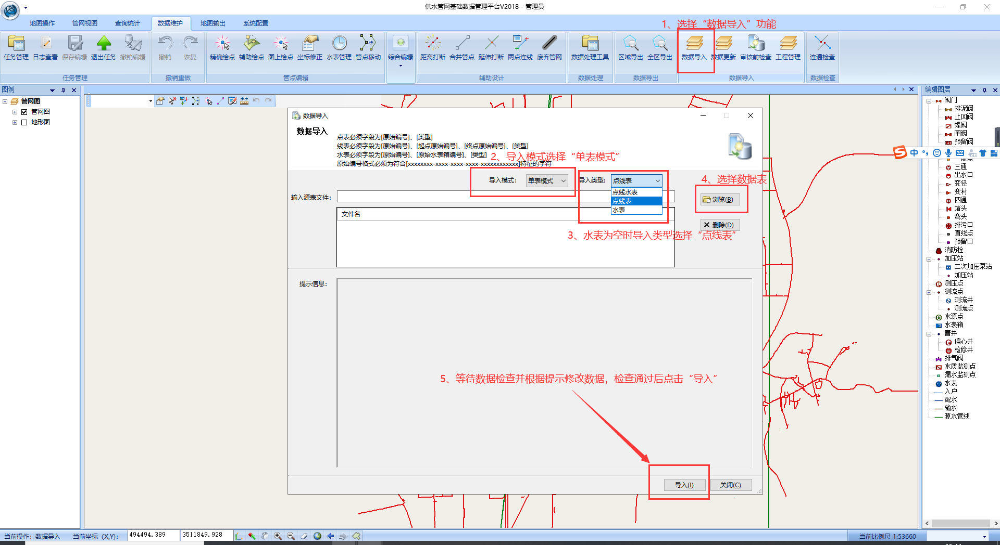

###  1.1.4 CAD导出

    1）提升导出速度
    2）允许导出地形图
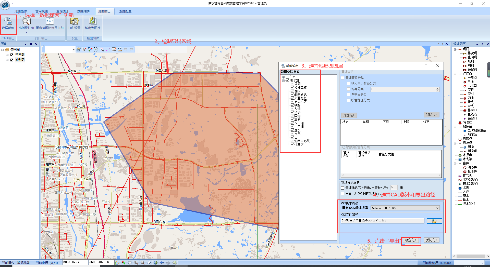

##   1.2新增
###  1.2.1 更新阀门属性信息

    允许“数据更新”操作导入的数据更新阀门信息，也可新增导入数据。需修改阀门的信息导出除“区域导出”方式外，还可通过“区域查询”结果表格导出，此时导出表中的“GIS编号”字段为无用字段，导入时会出现提示信息但不影响导入。
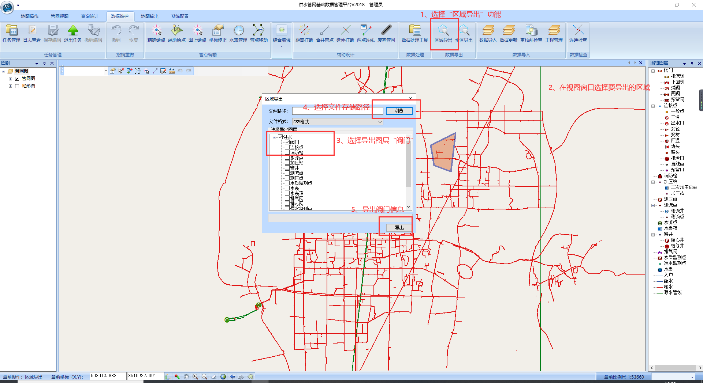
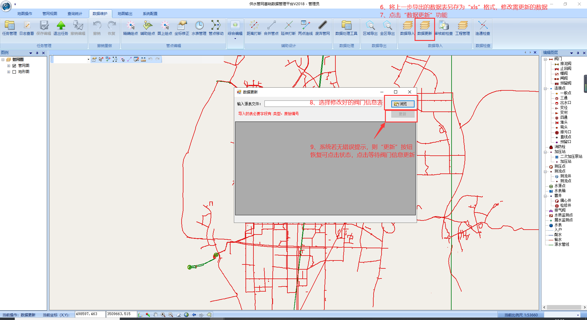

###  1.2.2 入库工程查询

    1）允许用户按自定义的时间、工程编号、工程名称查询的入库工程，查询细节可显示包含：多个工程的工程编号、工程名称、入库时间、入库人
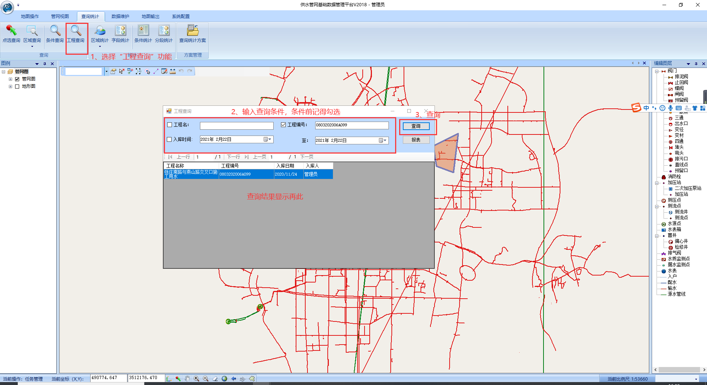

    2）在此统计页面设有“报表”按钮，点击后可显示选中工程的统计数据，该数据可导出成excel统计表格，选择统计项后点击“定位”可定位到总图中
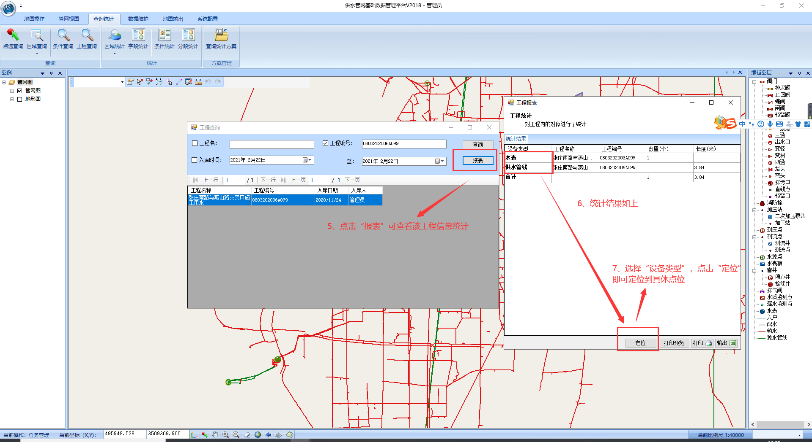
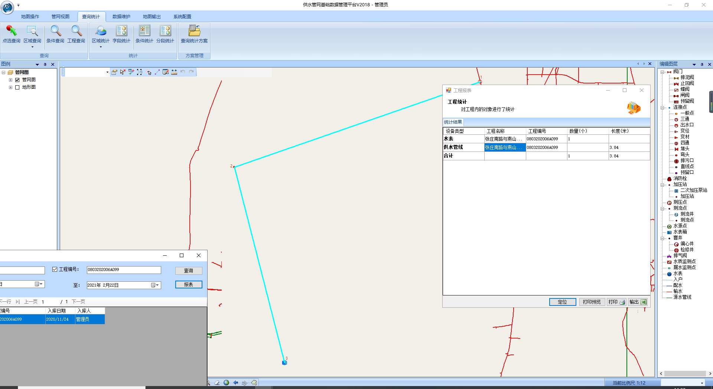
